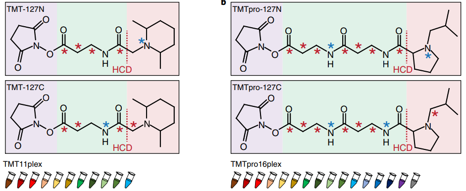

# TMT Analysis
TMT workflows for the extraction of differentially expressed proteins. In order to make use of the functions described in the script, please, check the functions directory where source code is shown. 

 

In order to make the TMT workflow work, and create the meta data, we need to create two dataframes:
- to_get_name
- to_get_vector

Here we will describe this data structure

## to_get_vector
|      | 126 | 127n  | 127c  | 128n  | 128c  | 129n  | 129c  | 130n  | 130c  | 131n  | 131c  | 132n  | 132c  | 133n  | 133c  | 134  |
|------|---|---|---|---|---|---|---|---|---|---|---|---|---|---|---|---|
| plex1 | 1 | 3  | 5  |  7 | 9  | 11  | 13  | 15  | 17  | 19  | 21  | 23  |  25 | 27  | 29  | POOL1  |
| plex2 | 2  |  4 |  6 |  8 | 10  | 12  |  14 | 16  | 18  | 20  | 22  | 24  |  26 | 28  | 30  | POOL2  |
| plexn | ...  | ...  | ... | ...  | ... | ... | ...  | ... | ... | ...  | ... | ... | ... | ... | ... | ...  |

## to_get_name
|Sample name  | Group name | Experimental group |
|--|--|--|
| 1 |  group1 | Control_lung|
| 2 |  group1 | Control_lung |
| 3|   group1|  Control_lung |
| 4|   group2| Control_liver |
| 5|   group2| Control_liver |
| 6|   group2| Control_liver |
| 7|   group3| Control_TIF |
| 8|   group3| Control_TIF |
| 9|   group3| Control_TIF |
| 10|  group4| Control_heart |
| 11|  group4| Control_heart |
| 12|  group4| Control_heart |
| 13|  group5| Control_spleen |
| 14|  group5| Control_spleen |
| 15|  group5| Control_spleen |
| 16 | group6| NIBAN1_KO_lung |
| 17 | group6| NIBAN1_KO_lung |
| 18|  group6| NIBAN1_KO_lung |
| 19 | group7| NIBAN1_KO_liver |
| 20 | group7| NIBAN1_KO_liver |
| 21 | group7| NIBAN1_KO_liver |
| 22 | group8| NIBAN1_KO_TIF |
| 23 | group8| NIBAN1_KO_TIF |
| 24 | group8| NIBAN1_KO_TIF |
| 25 | group9| NIBAN1_KO_heart|
| 26 | group9| NIBAN1_KO_heart |
| 27 | group9| NIBAN1_KO_heart |
| 28 | group10| NIBAN1_KO_spleen |
| 29 | group10| NIBAN1_KO_spleen  |
| 30 | group10| NIBAN1_KO_spleen |
| POOL1 | POOL |POOL |
| POOL2 | POOL |POOL |